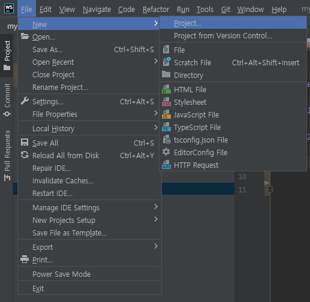
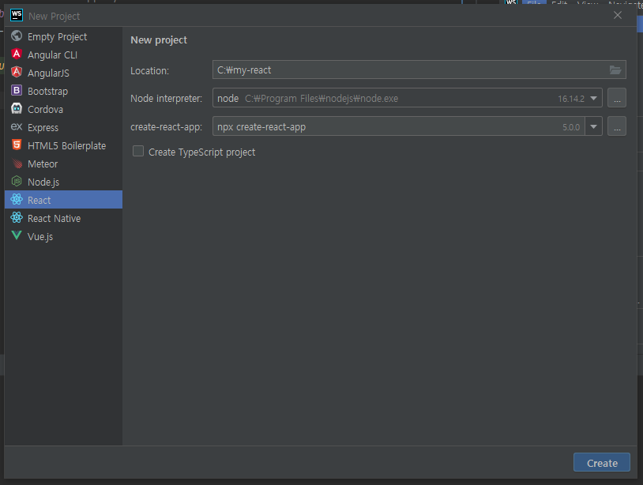
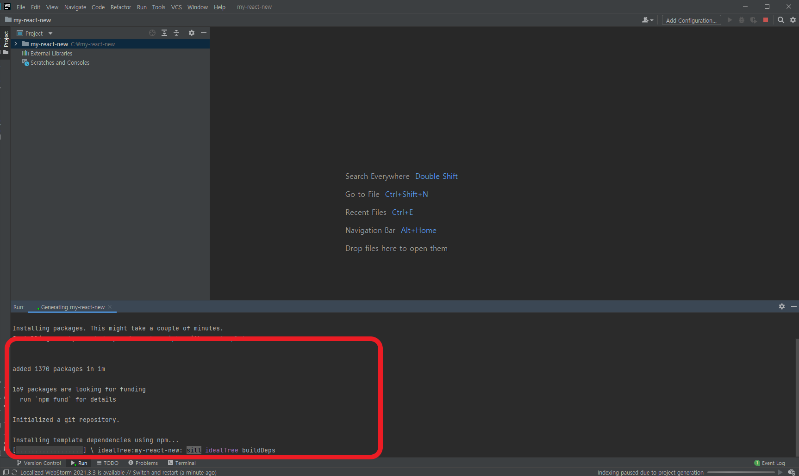
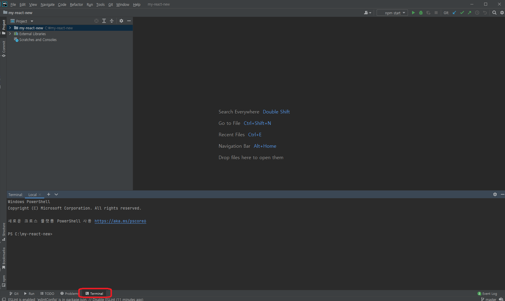
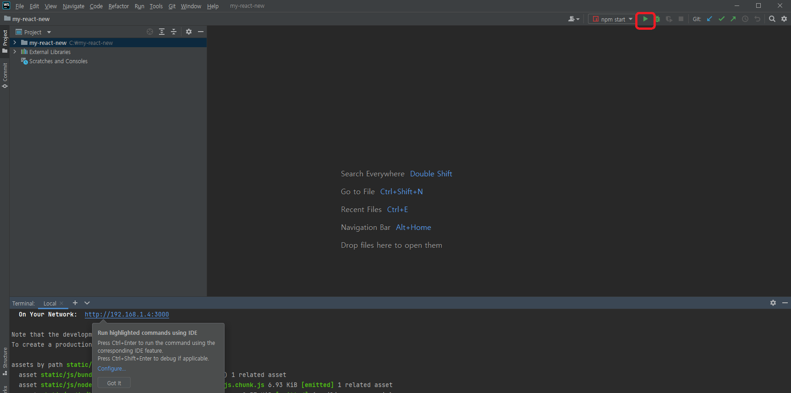

React Study Note 

# 1. React Project 생성 및 확인
## 1-1)  생성방법  (cra 이용)
### 방법1) npx 를 이용
    npx create-react-app my-react
### 방법2) webstorm project 를 통한 생성  
Step1. File -> New -> Project 선택 

   

Step2. React 선택  
* Location 에 프로젝트 경로를 입력하고, create 버튼을 누름

* 설치 진행중  

## 1-2) 실행 방법  
### 방법1) terminal 이용  
Step1. webstorm 의 terminal 을 연다.

Step2. npm run start 를 입력한다.

    npm run start

### 방법2) webstrom starter 이용
* 화면 우측 상단에 Run npm start 아이콘 클릭(초록색 play 버튼)  또는 shift+f10
* 

# 2. CRA 주요 구성요소
다양한 기능을 하지만, 현재는 간단한 컨셉만 알아보도록 한다.  
과외에서 eject 를 하거나, customize cra 를 한다면 그때 더 자세히 보는게 낫다.
## 2-1) babel
바벨은 자바스크립트 최신 자바스크립트 문법을 구형 브라우저에서도 돌 수 있도록 코드 자체를 변환시켜줌.
## 2-2) webpack
module bundling  역할을 한다.  
module bundling: 일단, js,jsx,scss,css,image 등을 각각 html, js , css  하나의 파일(모듈링)로 묶어 컴파일 해주는 개념이라고만 생각하자.

